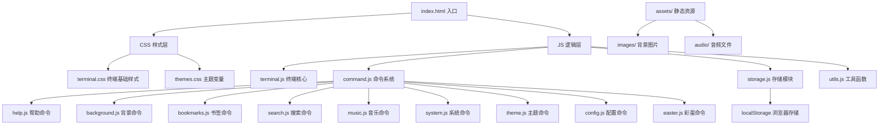

# GeekStart 技术架构文档

## 1. 架构设计



## 2. 技术描述

- **前端**：原生 HTML5 + CSS3 + JavaScript (ES6+)
- **构建工具**：无需构建工具，原生即可运行
- **数据持久化**：localStorage
- **部署**：GitHub Pages
- **目标环境**：现代浏览器（Chrome / Firefox / Edge / Safari），仅桌面端

## 3. 项目目录结构

```
geek-start/
├── index.html              # 入口页面
├── server.js               # Express 后端服务
├── package.json            # 项目依赖配置
├── .env.example            # 环境变量示例
├── css/
│   ├── terminal.css        # 终端基础样式
│   └── themes.css          # 主题样式
├── js/
│   ├── terminal.js         # 终端核心
│   ├── command.js          # 命令注册与分发
│   ├── storage.js          # localStorage 封装
│   ├── utils.js            # 工具函数
│   └── commands/
│       ├── help.js
│       ├── background.js
│       ├── bookmarks.js
│       ├── search.js
│       ├── music.js
│       ├── system.js
│       ├── theme.js
│       ├── config.js
│       ├── easter.js
│       └── ai.js           # AI 对话模块
├── assets/
│   ├── images/             # 背景图片
│   └── audio/              # 背景音乐
├── config/
│   └── default.json        # 默认配置
└── README.md
```

## 4. 核心模块设计

### 4.1 终端核心 (terminal.js)

**职责**：
- 模拟终端输入区域
- 管理光标闪烁
- 维护命令历史（↑↓ 键）
- 渲染输出结果

**核心 API**：
```javascript
Terminal.init()           // 初始化终端
Terminal.print(text)      // 输出文字
Terminal.println(text)    // 输出一行
Terminal.clear()          // 清屏
Terminal.focus()          // 聚焦输入
Terminal.onInput(callback) // 注册输入回调
```

### 4.2 命令系统 (command.js)

**设计模式**：命令注册表（Registry）

```javascript
// 命令结构
{
  name: 'command-name',
  alias: ['cmd'],
  description: '命令描述',
  usage: 'command-name [args]',
  handler: async (args) => { ... }
}
```

**核心 API**：
```javascript
CommandRegistry.register(cmd)    // 注册命令
CommandRegistry.execute(input)   // 执行命令
CommandRegistry.complete(prefix) // Tab 补全
CommandRegistry.list()           // 获取所有命令列表
```

### 4.3 存储模块 (storage.js)

**存储项**：
| Key | 内容 |
|-----|------|
| `geekstart_bookmarks` | 书签列表 |
| `geekstart_config` | 用户配置 |
| `geekstart_history` | 命令历史（最近 100 条） |
| `geekstart_theme` | 当前主题 |

### 4.4 配置数据结构

```json
{
  "username": "geek",
  "defaultSearch": "google",
  "theme": "default",
  "backgroundInterval": 30000,
  "soundEnabled": false
}
```

### 4.5 书签数据结构

```json
{
  "bookmarks": [
    { "name": "GitHub", "url": "https://github.com" },
    { "name": "Gmail", "url": "https://mail.google.com" }
  ]
}
```

## 5. 部署方案

- **平台**：GitHub Pages
- **分支**：main
- **访问地址**：`https://<username>.github.io/geek-start/`
- **部署方式**：直接推送静态文件
